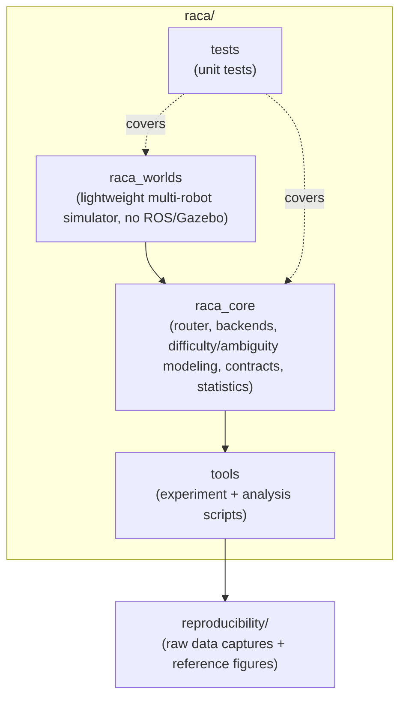

# RACA: Robotic Adaptive Cognitive Architecture

[](LICENSE)
[](https://doi.org/10.5281/zenodo.21961820)
[](raca/tests)

RACA studies a boundary-condition question: **under what circumstances
does spending an LLM call on a robot coordination decision pay for its
cost, and when does that benefit collapse to noise?** This repository is
the ROS-free, dependency-light core behind that study: routers, backend
abstractions, a lightweight multi-robot simulator, and statistics
tooling — not a claim to a novel architecture on its own.

This repository contains:

- **`raca/`** — the software: `raca_core` (routing logic, LLM/deterministic
  backends, difficulty/ambiguity modeling, contracts, statistics),
  `raca_worlds` (a lightweight simulator with no ROS/Gazebo dependency),
  `raca/tools` (the experiment and analysis scripts behind the paper's
  results), and `raca/tests` (unit tests covering the above).
- **`reproducibility/`** — the raw data captures (`data/*.txt`, real
  captured stdout from the `raca/tools/*.py` scripts) and reference
  figures (`figures/*.png`) needed to reproduce the manuscript's
  quantitative results; see `reproducibility/README.md`.

The manuscript itself, the internal pre-submission audit trail, the
literature review working notes, and the full chronological research
journal are kept private and are not part of this public release; they
are not required to reproduce the reported results.

## Architecture



`raca_worlds` drives simulated multi-robot scenarios; `raca_core` decides,
per coordination event, whether to route to a deterministic backend or an
LLM backend (local Ollama by default, or a cloud provider via `.env`).
`tools` runs the experiments and analysis behind the manuscript's results,
and the captured output is archived in `reproducibility/` for independent
reproduction.

## Quick start

```bash
python3 -m venv .venv
source .venv/bin/activate   # or .venv\Scripts\activate on Windows
pip install pytest

# Run the full unit test suite (no ROS 2 / Gazebo / GPU required)
python3 -m pytest raca/tests -q
```

The default LLM backend is a **local Ollama server** (no API key, no
per-token cost). If you want to use a cloud LLM provider instead, copy
`.env.example` to `.env` and fill in the relevant key — never commit a
real `.env` file.

```bash
cp .env.example .env
```

## Related work

This project builds on an earlier, separate ROS 2 warehouse-AMR
platform by the same author
([warehouse-amr-ros2](https://github.com/Pouya-Mansournia/warehouse-amr-ros2)).
That earlier codebase is not included in this repository.

## License

BSD 3-Clause, see `LICENSE`.

## Citation

If you use this work, please cite it — see `CITATION.cff`.
Archived release DOI: [10.5281/zenodo.21961820](https://doi.org/10.5281/zenodo.21961820).

## Contact

Pouya Mansournia, p.mansournia@gmail.com

## Contributing / Security

See `CONTRIBUTING.md` and `SECURITY.md`.
